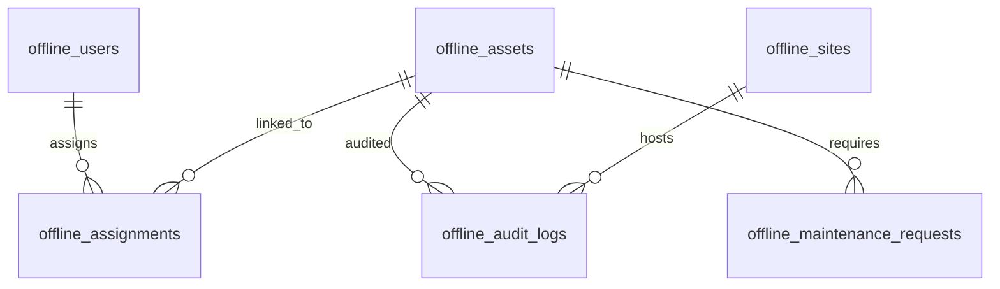

# Developer Portfolio & Architectural Manual — Asset Guard (Standalone SQL Edition)

**Asset Guard** is an industry-grade, production-ready native Android Enterprise Asset Management (EAM) and Incident Tracking application built in **Kotlin using Jetpack Compose**. It is engineered to operate in **100% Standalone Standalone Mode**, storing all record categories in a **10-Table Room SQLite SQL Database** with zero external cloud dependencies.

This manual serves as your complete project dossier for client presentations, internship reviews, and engineering evaluations.

---

## 📈 Executive Summary: The Business Value of Asset Guard

### The Core Problem: "Asset Leakage"
Most construction companies, industrial contractors, and logistics firms lose up to **10% to 15% of their physical equipment annually** (hand tools, generators, safety gear, vehicles) due to poor tracking. This is called **"asset leakage"**.
*   **Financial Drain**: Tools are repeatedly replaced, blowing out operational margins.
*   **Project Delays**: Crews arrive at a site only to find critical equipment is missing.
*   **Security Concerns**: Unaudited equipment can be stolen, misplaced, or unsafely used by uncertified personnel.

### The Solution: Asset Guard
Asset Guard establishes a secure, local **digital twin ledger** of the physical workplace. It solves asset leakage through three bulletproof mechanisms:
1.  **Strict Checkout Workflows**: Every tool checked out from the warehouse is linked to a specific employee and project by scanning its barcode.
2.  **Geofenced Location Audits**: Auditors must perform physical presence checks. The app captures their Fused GPS coordinates and cross-references them against the target construction site coordinates using the **Haversine formula**. If they are outside the geofence radius, a warning flag is raised.
3.  **Financial Transparency**: Straight-line depreciation calculations let managers track exact invested vs. depreciated valuation changes across all assets.

---

## 🚀 Detailed Feature Matrix

| Feature Module | Business Purpose | Implementation Mechanism |
| :--- | :--- | :--- |
| **Searchable Directory** | Eliminates lost paperwork by providing a secure inventory search. | SQL text querying on Name, Category, Serial, and Barcode fields. |
| **ML Kit Scanner Workflow** | Prevents equipment displacement during tool checkout pipelines. | Integrates CameraX viewfinder running Google ML Kit's Barcode Analyzer. |
| **Geofenced Audits** | Verifies physical presence of tools at construction sectors. | Fused Location Provider API + **Haversine Distance Algorithm** vs. Site boundaries. |
| **Straight-Line Depreciation** | Tracks equipment valuation decay for company balance sheets. | Calculates $(\text{Age in Years} \times \text{Depreciation Rate})$ vs. initial purchase price. |
| **Canvas Ring Charts** | Visualizes tool lifecycle states and capital site share in real-time. | Jetpack Compose `Canvas` layouts drawing dynamic arcs (`drawArc`). |
| **Bulk CSV Spreadsheet Ingest** | Enables instant setup by importing thousands of tools at once. | Commas-delimited spreadsheet text parser running inside a Room transaction. |

---

## 🗄️ Unified 10-Table SQLite Database Schema

The app uses **Room SQLite** as its absolute source of truth. The schemas are declared in [OfflineModels.kt](file:///c:/games/ayesha%202/app/src/main/java/com/tourism/smartguide/data/local/OfflineModels.kt) and bound via [LocalDatabase.kt](file:///c:/games/ayesha%202/app/src/main/java/com/tourism/smartguide/data/local/LocalDatabase.kt):



1.  **`offline_users` (Roster Accounts)**: Mapped for local registration, sign-in, and Role-Based Access Controls (RBAC).
2.  **`offline_assets` (Tools Registry)**: Mapped for serials, barcodes, multi-image JPEGs, status, and purchase details.
3.  **`offline_assignments` (Checkouts)**: Records exact assignment transactions mapping tools to employees and projects.
4.  **`offline_audit_logs` (Presence Audits)**: Stores precise Lat/Lng coordinates, timestamps, auditor profiles, and geofence verification results.
5.  **`offline_maintenance_requests` (Repairs)**: Tracks repair schedules, repair notes, and cost ledgers.
6.  **`offline_asset_requests` (Relocations)**: Coordinates asset transport orders and approvals.
7.  **`offline_sites` (Sector Bounds)**: Maintains construction zone GPS coordinates and geofence radius bounds.
8.  **`offline_notifications` (Push Notifications)**: Alerts employees on missing or leaked assets.
9.  **`offline_activity_logs` (Security Trail)**: Strict audit trail tracking all manager account actions and device IP mappings.
10. **`offline_reports` (Balance Sheets)**: Caches compiled financial reports.

---

## 📐 Under the Hood: Key Technical Algorithms

### 1. The Geodistance Geofencing Formula (Haversine)
To verify if an auditor is actually standing in Colombo Port City or Warehouse HQ when performing an audit, the app utilizes the **Haversine formula** implemented in [AssetViewModel.kt](file:///c:/games/ayesha%202/app/src/main/java/com/tourism/smartguide/viewmodel/AssetViewModel.kt):

```kotlin
fun isWithinSiteGeofence(site: Site, userLat: Double, userLng: Double): Boolean {
    val earthRadius = 6371000.0 // meters
    val dLat = Math.toRadians(userLat - site.latitude)
    val dLng = Math.toRadians(userLng - site.longitude)
    val a = sin(dLat / 2).pow(2.0) +
            cos(Math.toRadians(site.latitude)) * cos(Math.toRadians(userLat)) *
            sin(dLng / 2).pow(2.0)
    val c = 2 * atan2(sqrt(a), sqrt(1 - a))
    val distance = earthRadius * c
    return distance <= site.radiusMeters
}
```

### 2. straight-Line Asset Depreciation Ledger
To satisfy corporate accounting audits, the app automatically tracks equipment value decay from the initial purchase date to the exact current millisecond:
*   **Annual Depreciation** = $\text{Purchase Price} \times \frac{\text{Depreciation Rate}}{100}$
*   **Asset Age in Years** = $\frac{\text{Current Time} - \text{Purchase Date Time}}{1000 \times 60 \times 60 \times 24 \times 365.25}$
*   **Current Depreciated Value** = $\max\left(0.0, \text{Purchase Price} - (\text{Asset Age} \times \text{Annual Depreciation})\right)$

---

## 🔍 Validation Guide (Pre-seeded Logins)

The application automatically seeds standard corporate sectors, employees, and high-value tools on its very first launch, making verification instant for reviewers:

### Seeded Credentials (100% Offline-Capable)
*   **Manager Profile (Administrative control)**:
    *   **Email**: `manager@assetguard.com`
    *   **Password**: `manager123`
*   **Auditor Profile (Verification tasks)**:
    *   **Email**: `auditor@assetguard.com`
    *   **Password**: `auditor123`

### Verification Flow inside Android Studio
1.  **Zero-Configuration Build**: Open Android Studio ➔ click **Sync Project with Gradle Files** ➔ **Run** (`Shift + F10`). The app compiles instantly without needing a `google-services.json` file.
2.  **Roster Account Creation**: Navigate to the Sign Up screen and create a new account. The app registers them inside Room SQLite instantly, supporting logins immediately.
3.  **Checkout & Audits (Emulator Bypass)**: Log in as a Manager, go to **Checkout**, and assign a seeded tool to a worker. Use the selector list at the bottom to bypass the camera scanner if running on an emulator. Log audits, and watch the circular ring valuation charts in **Reports** adjust in real time!
